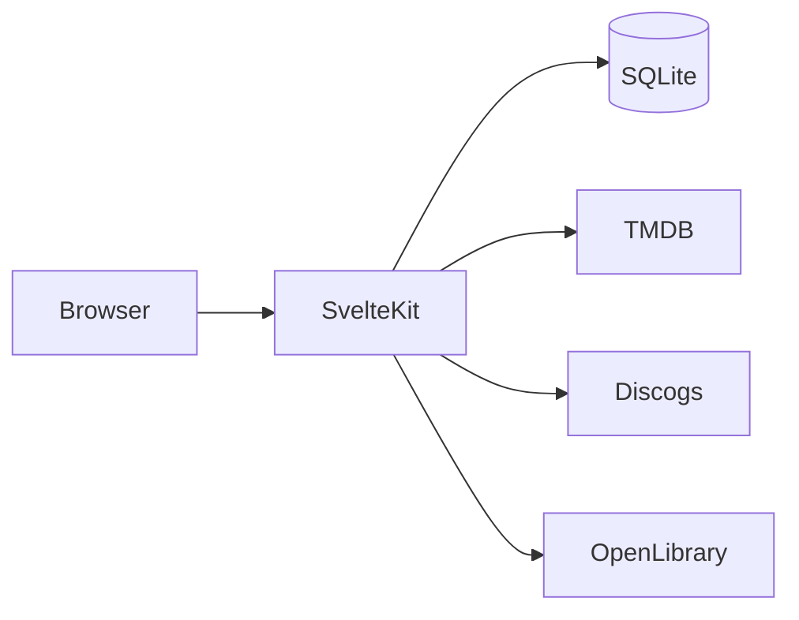

# Architecture

## Overview

Media Club is a SvelteKit 2 application with:

- **Public read** routes for browsing collections and wishlists
- **Admin-only write** routes protected by session cookies
- **Server-side API proxies** for TMDB, Discogs, and Open Library
- **SQLite** via Drizzle ORM (Cloudflare D1 or local file)

## Data model

Single `items` table with discriminated `category` and `list_type`:

| Column        | Purpose                                            |
| ------------- | -------------------------------------------------- |
| `category`    | `movie`, `show`, `music`, `book`                   |
| `list_type`   | `owned`, `wishlist`                                |
| `external_id` | Provider ID (TMDB, Discogs, Open Library work key) |
| `metadata`    | JSON blob for extra provider fields                |

Unique constraint on `(category, external_id, list_type)` prevents duplicates.

Auth uses `admin_user` + `session` tables. Only one admin account is seeded; there is no public registration.

## Auth flow

1. Admin posts username/password to `/login`
2. Server verifies PBKDF2 password hash
3. Session token stored in HTTP-only cookie and `session` table
4. `hooks.server.ts` validates session on each request
5. Mutations check `locals.user`; API search returns 401 without session

## Database adapters

| Environment        | Storage                                      |
| ------------------ | -------------------------------------------- |
| `npm run dev`      | `./data/media-club.db` via better-sqlite3    |
| Cloudflare Workers | D1 binding `DB`                              |
| Docker             | `/app/data/media-club.db` via better-sqlite3 |

`getDb()` in `src/lib/server/db/index.ts` picks the backend based on `platform.env.DB`.

## Security

- API keys server-side only
- Rate limiting on `/api/search` (30 req/min per IP)
- CSRF protection via SvelteKit form actions
- Security headers in `hooks.server.ts`
- No open sign-up

## Extending categories

Adding TV shows or games later only requires:

1. New `category` enum value
2. A search provider in `src/lib/server/apis/`
3. A route page and nav link

The unified `items` schema avoids per-type tables.
